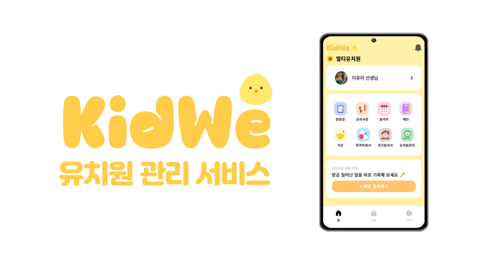
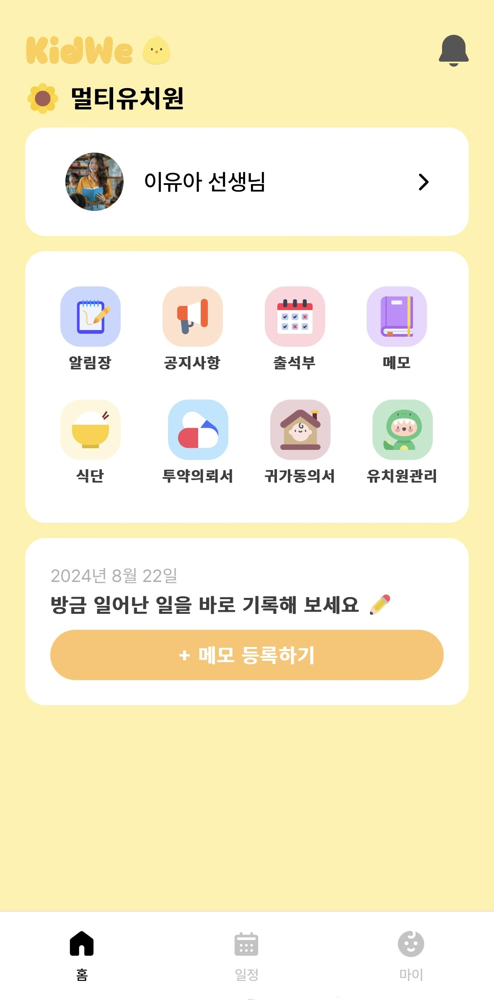
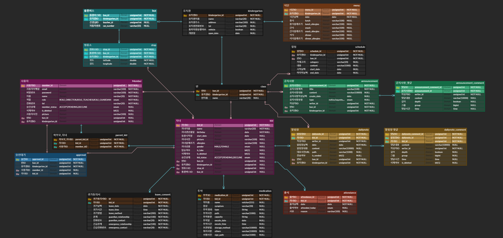
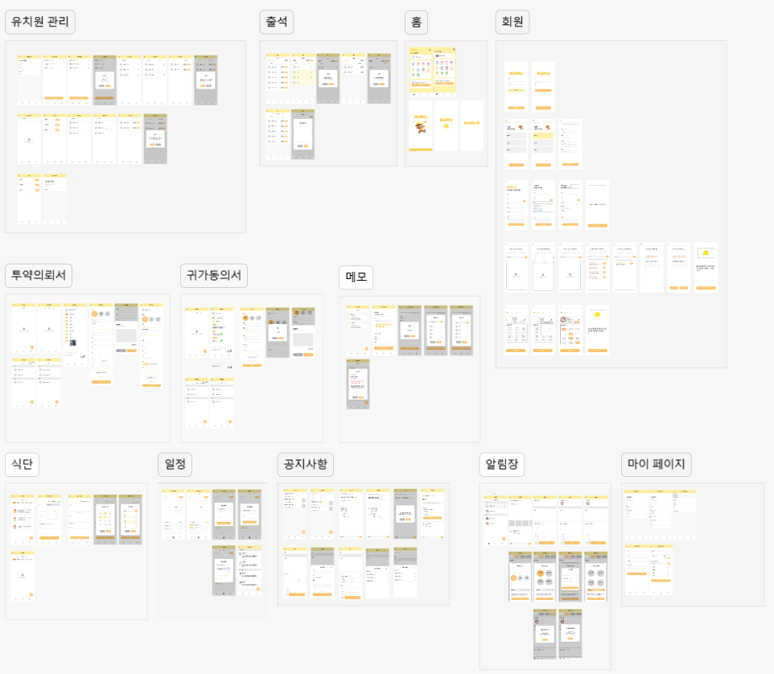
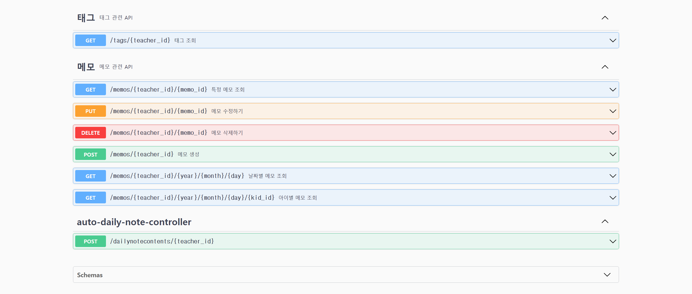

# 유치원 통합 관리 서비스, KidWe 🥝

  

## 📅 프로젝트 정보

### SSAFY 11기 2학기 공통 프로젝트

**✨ 공통 프로젝트 최우수상 ✨**

2024.07.02(화) ~ 2024.08.16(금) [7주]

 

## 🐣 주제

아이 돌봄, 관찰, 학부모와의 소통 등 여러 업무로 야근에 시달리는 선생님에게 도움의 손길을 내미는 **유치원 통합 관리 서비스**

 

## 👩‍🏫 기획 배경

> 유치원 선생님에게 과중된 업무를 덜어주자!

- 전국 유치원 학급 당 평균 아동 수: 16.1명
- 유치원 교사 하루 근무시간 평균: 9시간 18분

> 어린이집/유치원 관련 종사자 대상 설문조사 실시

- 원생 관리에 도움이 필요한 서비스는?

  - 알림장 작성의 **간편화** 기능
  - 유치원 내의 일정 공유 기능

- 알림장 작성할 때 겪는 어려움은?
  - 아이에게 일어난 일을 **복기**하기 어려움
  - 근무 시간 중 작성할 **시간이 부족**함

 

## 📝 기능 소개

> 사용자 인증 🪪

- **회원가입**
  - 원장님👸은 본인의 유치원을 등록할 수 있어요.
  - 선생님👩‍🏫과 학부모💑는 본인의 유치원을 검색할 수 있어요.
- **로그인**

> 알림장 📒

- **알림장 조회**
  - 원장님👸은 반을 선택해서 월별로 특정 반을 조회할 수 있어요.
  - 선생님👩‍🏫과 학부모💑는 월별로 서로의 알림장을 확인할 수 있어요.
  - 사진 썸네일을 클릭하면 여러 장의 사진을 스와이프하며 확인하고 저장할 수 있어요.
  - 원장님👸, 선생님👩‍🏫, 학부모💑는 알림장에 댓글을 남기고 답글을 달 수 있어요.
- **알림장 작성**
  - 선생님👩‍🏫이 학부모💑에게, 학부모💑가 선생님👩‍🏫에게 작성할 수 있어요.
  - 선생님👩‍🏫은 오늘 하루 작성한 메모를 기반으로 알림장을 **자동 생성**할 수 있어요.
  - 여러 장의 사진을 첨부할 수 있어요.
  - 먼저 작성하고 예약 전송을 통해 나중에 전송할 수 있어요.
- **알림장 수정, 삭제**
  - 예약 전송 시간 5분 전까지 수정할 수 있어요.
  - 본인이 작성한 글과 본인이 작성한 댓글만 삭제할 수 있어요.

> 공지사항 📢

- **공지사항 조회**
  - 원장님👸은 반을 선택해서 월별로 특정 반을 조회할 수 있어요.
  - 선생님👩‍🏫과 학부모💑는 전체 공지와 소속반 공지만 확인할 수 있어요.
  - 사진 썸네일을 클릭하면 여러 장의 사진을 스와이프하며 확인하고 저장할 수 있어요.
  - 원장님👸, 선생님👩‍🏫, 학부모💑는 공지사항에 댓글을 남기고 답글을 달 수 있어요.
- **공지사항 작성**
  - 원장님👸은 전체 공지를, 선생님👩‍🏫은 반별 공지를 남길 수 있어요.
  - 여러 장의 사진을 첨부할 수 있어요.
  - 작성하다가 만 글을 임시 저장할 수 있어요.
  - 임시 저장한 글은 임시 보관함에서 확인하고 불러올 수 있어요.
- **공지사항 수정, 삭제**
  - 본인이 작성한 글을 수정할 수 있어요.
  - 본인이 작성한 글과 본인이 작성한 댓글만 삭제할 수 있어요.

> 출석부 ⏰

- **출석 처리**
  - 선생님👩‍🏫은 소속반의 원생들을 출석, 결석 처리할 수 있어요.
  - 결석 처리할 때는 결석 사유를 입력할 수 있어요.
  - 여러 명의 원생을 선택하거나 전체 선택을 통해 일괄 출석 처리할 수 있어요.
  - 잘못 선택했다면 출석 처리한 학생을 다시 미처리로 돌릴 수 있어요.
  - 출석 미처리한 학생과 처리 완료한 학생을 구분할 수 있어요.

> 메모 📋

- **메모 타임라인 조회**

  - 선생님👩‍🏫은 하루 동안 작성한 메모를 타임라인 형태로 볼 수 있어요.
  - 이 메모는 알림장 자동 생성의 자료로 사용돼요.

- **메모 작성**
  - 선생님👩‍🏫은 태그를 활용해 메모를 간편하게 작성할 수 있어요.
  - 현재 일어난 일을 바로 기록할 수 있도록 날짜와 시간은 현재 시간이 기본값이에요. 선생님이 임의로 수정할 수도 있어요.
  - 태그, 원생, 수업, 기타 중에 하나만 선택/입력해도 메모를 등록할 수 있어요.

> 식단 🍚

- **식단 조회**
  - 원장님👸, 선생님👩‍🏫, 학부모💑는 일자별 식단을 조회할 수 있어요.
  - 점심, 간식, 저녁에 대해 메뉴와 알레르기 정보, 알레르기 주의 학생을 확인할 수 있어요.
    - 식단 등록할 때 선택한 알레르기 정보와 학부모가 아이를 등록할 때 선택한 알레르기 정보를 바탕으로 알레르기 주의 학생을 표시해요.
- **식단 등록**
  - 원장님👸과 선생님👩‍🏫은 선택한 날짜에 대해 식단(점심, 간식, 저녁)을 등록할 수 있어요.
  - 각 식단에 메뉴 이름들을 입력하고 해당 메뉴의 알레르기 정보를 선택해요.
- **식단 수정, 삭제**

> 투약의뢰서 💊

- **투약의뢰서 조회**
  - 원장님👸과 선생님👩‍🏫은 학부모💑가 작성한 투약의뢰서를 월별로 확인할 수 있어요.
- **투약의뢰서 작성**
  - 학부모💑는 투약 정보(투약일, 증상, 약 사진, 약 이름, 약 종류, 투약 용량, 투약 횟수, 투약 시간, 약 보관 방법, 비고)를 입력하여 투약의뢰서를 작성할 수 있어요.
  - 서명을 완료해야 투약의뢰서를 등록할 수 있어요.
- **투약의뢰서 삭제**

> 귀가동의서 🏠

- **귀가동의서 조회**
  - 원장님👸과 선생님👩‍🏫은 학부모💑가 작성한 귀가동의서를 월별로 확인할 수 있어요.
  - 보호자와 비상연락처 전화번호를 따로 찾을 필요 없이 전화 버튼을 누르면 해당 번호로 바로 전화 걸 수 있도록 도와줘요.
- **귀가동의서 작성**
  - 학부모💑는 귀가 정보(귀가일, 귀가 시간, 귀가 방법, 보호자 관계와 전화번호, 비상연락처 관계와 전화번호)를 입력하여 귀가동의서를 작성할 수 있어요.
  - 서명을 완료해야 귀가동의서를 등록할 수 있어요.
- **귀가동의서 삭제**

> 유치원 관리 🏫

- **교사 관리**

  - 원장님👸이 교사 등록 요청에 대해 승인, 거절할 수 있어요.
    - 선생님이 유치원 등록을 요청하면 대기 목록에 떠요.
  - 원장님👸이 선생님👩‍🏫을 퇴원 처리할 수 있어요.

- **원생 관리**

  - 선생님👩‍🏫이 아이 등록 요청에 대해 승인, 거절할 수 있어요.
    - 학부모가 유치원에 아이 등록을 요청하면 대기 목록에 떠요.
  - 선생님👩‍🏫이 원생을 퇴원 처리할 수 있어요.

- **반 관리**
  - 원장님👸은 유치원의 반을 추가할 수 있어요.
  - 반 이름을 변경할 수 있어요.

> 일정 📆

- **일정 조회**
  - 원장님👸, 선생님👩‍🏫, 학부모💑는 날짜를 클릭하면 해당일의 일정을 볼 수 있어요.
- **일정 등록**
  - 원장님👸은 전체 일정울, 선생님👩‍🏫은 반별 일정을 등록할 수 있어요.

> 마이페이지 👶

- **사용자 정보**
  - 원장님👸, 선생님👩‍🏫, 학부모💑는 사용자 정보를 확인할 수 있어요.
  - 자신의 프로필 이미지, 비밀번호, 전화번호를 변경할 수 있어요.
- **아이 정보**
  - 학부모💑는 아이의 정보를 확인할 수 있어요.
  - 아이의 프로필 이미지, 이름, 생년월일, 성별, 알레르기 정보를 수정할 수 있어요.

 

## 📱 서비스 화면

|                                                                                                  |                                                                                                    |                                                                                                        |                                                                                                        |
| :----------------------------------------------------------------------------------------------: | :------------------------------------------------------------------------------------------------: | :----------------------------------------------------------------------------------------------------: | :----------------------------------------------------------------------------------------------------: |
|                         |  <video src="assets/screenshots/videos/KidWe_일정.mp4" width="250px" autoplay loop muted></video>  |                                |    <video src="assets/screenshots/videos/KidWe_식단.mp4" width="250px" autoplay loop muted></video>    |
|                                            메인 화면                                             |                                             일정 관리                                              |                                                공지사항                                                |                                                  식단                                                  |
| <video src="assets/screenshots/videos/KidWe_메모.mp4" width="250px" autoplay loop muted></video> | <video src="assets/screenshots/videos/KidWe_알림장.mp4" width="250px" autoplay loop muted></video> | <video src="assets/screenshots/videos/KidWe_투약의뢰서.mp4" width="250px" autoplay loop muted></video> | <video src="assets/screenshots/videos/KidWe_귀가동의서.mp4" width="250px" autoplay loop muted></video> |
|                                            메모 등록                                             |                                          알림장 자동 생성                                          |                                               투약의뢰서                                               |                                               귀가동의서                                               |

 

## 🔎 기술 스택

> Frontend

  
  
  
  

  
  
  

  
  
  

 

> Backend

  
  
  
  

  
  
  
  

 

> CI/CD

  
  
  
  
  

 

> Collaboration Tool

  
  
  
  
  
  

  
  
  

 

## 🧩 ERD

 

## 🗃️ 아키텍처

> 주요 아키텍처

- **MySQL & MongoDB**
  - 데이터의 특성에 맞는 DB를 사용하기 위해 2개로 나누어서 관리하였다.
  - MySQL은 관계형 데이터베이스로서 회원, 일정, 급식, 공지사항, 투약의뢰서, 귀가동의서와 같은 구조화된 데이터를 관리하는데 적합하다.
  - MongoDB는 비정형 데이터인 알림장, 메모 데이터를 저장하기에 적합하다.
  - 회원, 일정, 급식, 공지사항, 투약의뢰서, 귀가동의서 서비스와 알림장, 메모 서비스는 각각 사용하는 데이터가 철저하게 분리되어 있고, 2개의 DB를 모두 사용하는 요청하는 횟수가 매우 적어 두 개의 서버로 분리해 보다 효율적으로 관리하였다.
- **PWA**
  - Kidwe 서비스는 유치원 선생님이 일과 중 사용하기에 모바일 환경이 더욱 편리하다 생각했다.

 

## 🎨 화면 설계서

[🔗 Figma](<https://www.figma.com/design/oip92RdSlprizyyOvtJ4OB/%ED%82%A4%EC%9C%84-(KidWe)?node-id=0-1&t=k3nqVD3Do1tuyns0-1>)

 

## 🔃 API 명세서

> MySQL

 

 

> MongoDB

 

 

## 🥝 팀원

| Name      | Roles                                   | GitHub                                         |
| :-------- | :-------------------------------------- | :--------------------------------------------- |
| 정다빈 👑 | 팀장, Frontend Leader, Frontend, Design | [@allempti](https://github.com/allkong)        |
| 강혁준 🐹 | Frontend                                | [@kanghyukjun](https://github.com/kanghyukjun) |
| 백승우 🍀 | Frontend, UCC                           | [@galler-ist](https://github.com/galler-ist)   |
| 변지환 🐶 | Backend Leader, Backend                 | [@JihwanByun](https://github.com/JihwanByun)   |
| 박동환 🍬 | Backend                                 | [@ParkDH0809](https://github.com/ParkDH0809)   |
| 서지민 🐰 | Backend, CI/CD                          | [@Dim0127](https://github.com/Dim0127)         |
